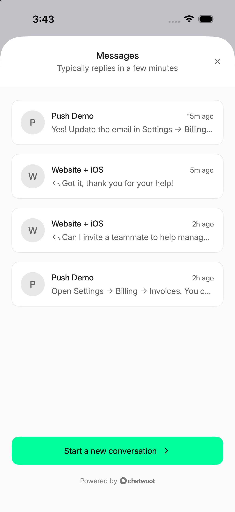
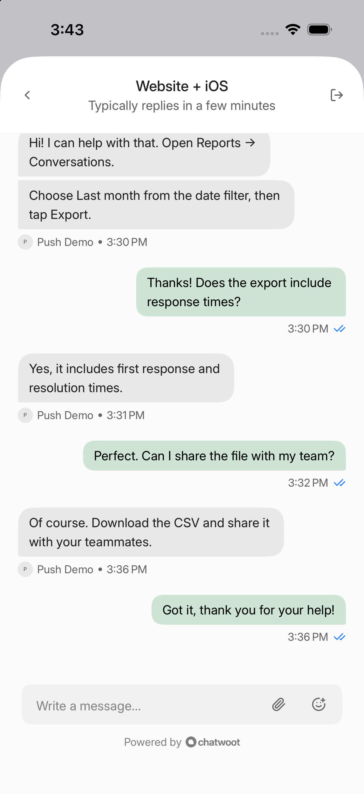
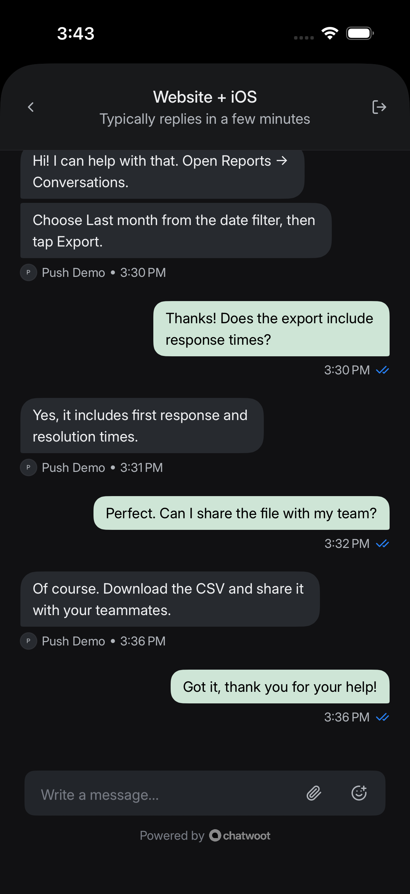

# Chatwoot iOS SDK

Add native customer support chat to your iOS app. The SDK connects to a Chatwoot Website inbox and provides a ready-to-use conversation list, chat screen, and pre-chat form.

> **Preview:** This SDK is under development and has not been released.

## Features

- Multiple conversations, message history, and unread counts.
- Text messages, basic Markdown, images, and file attachments.
- Live replies and automatic updates while support is open.
- Pre-chat forms using the Website inbox’s configured fields and validation.
- Anonymous chat and verified customer identification.
- Persistent sessions stored in Keychain.
- Push notification registration and navigation to the relevant conversation.
- Inbox branding, optional color overrides, and light/dark appearance.
- SwiftUI views that can also be presented from UIKit.

## Requirements

- iOS 17 or later.
- Swift 5.9 or later and an Xcode version supporting the target iOS version.
- A compatible Chatwoot backend, an SDK app connected to an Website inbox.
- A backend URL reachable from the app. Use HTTPS in production.
- For push notifications: an Apple Developer account, an app with Push Notifications enabled, and APNs credentials configured in Chatwoot.

The package has no third-party runtime dependencies. A separate API inbox is not required.

## Installation

For this preview, add the SDK as a local Swift package:

1. Open your app project in Xcode.
2. Choose **File → Add Package Dependencies → Add Local…**.
3. Select this repository’s folder and add **ChatwootSDK** to your app target.

Repository-based installation will be available after the new package is published and a release is tagged.

## Quick start

In **Chatwoot → Settings → Integrations → SDKs**, add an app, connect an Website inbox, and save it. Apple push configuration is optional. Copy the **SDK app ID**. Multiple SDK apps can connect to the same inbox.

Create one client for the current customer:

```swift
import Foundation
import SwiftUI
import ChatwootSDK

let client = ChatwootClient(configuration: .init(
    baseURL: URL(string: "https://support.example.com")!,
    sdkAppID: "YOUR_SDK_APP_ID"
))
```

Present `ChatwootView(client: client)` in a sheet or full-screen cover when the customer taps your support button. In UIKit, present it using `UIHostingController`.

The SDK uses the inbox’s branding and pre-chat settings automatically. Optional `accentColor` and `outgoingMessageColor` configuration properties override its colors. The example app uses a green preview palette; omit those overrides to follow inbox branding.

## Customer identity

Anonymous sessions work automatically. For signed-in customers, generate an identity signature on your backend and pass it to the SDK:

```swift
try await client.identify(
    identifier: customerID,
    signature: signatureFromYourBackend,
    name: customerName,
    email: customerEmail
)
```

Keep the signing secret on your backend. On logout, await `client.reset()` before switching customers. If reset fails, retry before switching. Register the push token again after successful identification.

## Push notifications

1. Enable **Push Notifications** for your app in Apple Developer and Xcode.
2. In **Chatwoot → Settings → Integrations → SDKs → Your app**, configure the Bundle ID, Team ID, Key ID, and APNs `.p8` key. The private key stays on the backend.
3. Request notification permission in your app and register with APNs. Forward the current device token to `client.registerDeviceToken(_:environment:name:)`, using the environment matching the app’s signing: development for sandbox and production for TestFlight/App Store.
4. Forward notification taps to `client.handleNotification(_:)`. When it returns `true`, present the support UI. Initialize the client before handling notification taps, including cold launch.

Your app owns its notification delegates and permission prompts. Chatwoot sends agent-reply notifications through APNs; no separate push-sending backend is needed. Chat works without notification permission.

See the [example app](Example/ChatwootDemo/ChatwootDemoApp.swift) for the integration code.

## Run the example

Open `Example/ChatwootDemo.xcodeproj`, select a simulator or device, and run **ChatwootDemo**. Enter the backend URL and SDK app identifier, then select **Connect and open support**.

For device builds, configure your own signing team and Bundle ID. Keep normal Xcode signing enabled for Keychain access. A physical device needs a backend URL reachable from that device; `localhost` refers to the device itself.

## Current limitations

- The first message must be text; attachments are available after the conversation is created. Large-upload handling is still being improved.
- No Home/Help Center tabs, audio recording, CSAT, or full support for rich interactive messages.
- UI text is currently English. Localization and full RTL review remain release work.
- Pre-chat messages are limited to 250 characters. Phone fields require international E.164 format; JavaScript-specific validation patterns may not work.
- Scheduled availability and next-opening-time display are not implemented.
- Sandbox push delivery and notification-tap routing have been verified in the simulator. Physical-device, production APNs, cold-launch, and identity-switching checks remain before release.

## Screenshots

| Conversations | Chat | Dark mode |
| --- | --- | --- |
|  |  |  |
